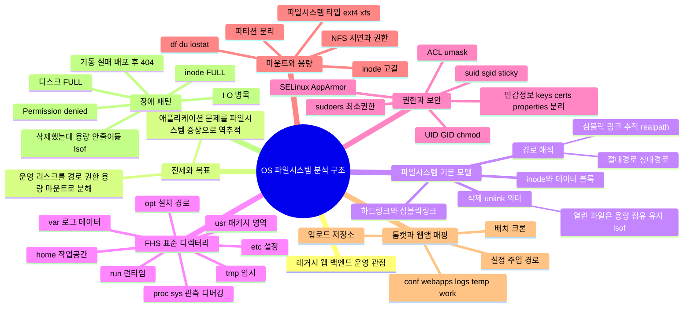

## 개요

- 본 글은 주니어 백엔드 개발자 관점에서 알아야 할 os 파일시스템 구조를 정리한 글입니다.

- 정리 방식은 마인드맵으로 큰 줄기를 뻗은 뒤, 작은 세부사항들은 글로 설명하는 방식입니다.

## 대분류

```mermaid

mindmap
  root((OS 파일시스템 분석 구조))
    레거시 웹 백엔드 운영 관점
    전제와 목표
      운영 리스크를 경로 권한 용량 마운트로 분해
      애플리케이션 문제를 파일시스템 증상으로 역추적
    파일시스템 기본 모델
      경로 해석
        절대경로 상대경로
        심볼릭 링크 추적 realpath
      inode와 데이터 블록
      하드링크와 심볼릭링크
      삭제 unlink 의미
        열린 파일은 용량 점유 유지 lsof
    FHS 표준 디렉터리
      etc 설정
      var 로그 데이터
      opt 설치 경로
      usr 패키지 영역
      home 작업공간
      tmp 임시
      run 런타임
      proc sys 관측 디버깅
    권한과 보안
      UID GID chmod
      suid sgid sticky
      ACL umask
      sudoers 최소권한
      SELinux AppArmor
      민감정보 keys certs properties 분리
    마운트와 용량
      파티션 분리
      파일시스템 타입 ext4 xfs
      inode 고갈
      NFS 지연과 권한
      df du iostat
    톰캣과 웹앱 매핑
      conf webapps logs temp work
      설정 주입 경로
      업로드 저장소
      배치 크론
    장애 패턴
      디스크 FULL
      inode FULL
      Permission denied
      삭제했는데 용량 안줄어듦 lsof
      기동 실패 배포 후 404
      I O 병목

```