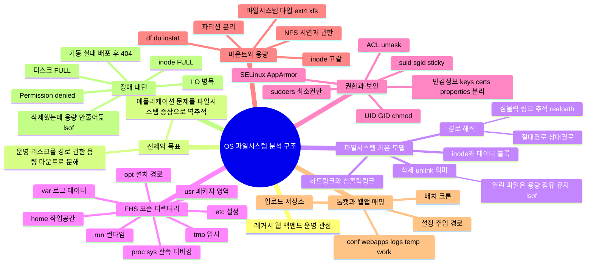
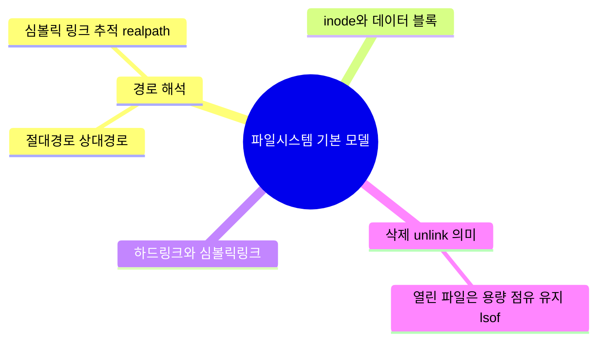

## 개요

- 본 글은 주니어 백엔드 개발자 관점에서 알아야 할 os 파일시스템 구조를 정리한 글입니다.

- 정리 방식은 마인드맵으로 큰 줄기를 뻗은 뒤, 작은 세부사항들은 글로 설명하는 방식입니다.

## 대분류

## 파일시스템 기본 모델

* **파일시스템 기본 모델은 왜 중요하냐**

  * 레거시 운영 장애의 원인(“파일이 없다/권한이 없다/용량이 안 준다/경로가 다르다”)은 대부분 파일시스템 기본 동작에서 나온다. 이 모델을 모르면 조치가 감으로 흐르고, “재기동하면 됨” 수준에서 원인 규명이 멈춘다.

## 1) 경로 해석

* **경로 해석이 왜 필요하냐**

  * 같은 코드라도 “어디서 실행했는지”, “서비스 매니저가 어떤 작업 디렉터리로 기동했는지”, “심볼릭 링크를 통해 어떤 실제 경로를 가리키는지”에 따라 파일을 못 찾거나 엉뚱한 파일을 읽는다. 레거시는 특히 상대경로/하드코딩이 섞여 있어 재현성 없는 장애를 만든다.

### 절대경로 상대경로

* **차이(운영 관점 핵심)**

  * 절대경로는 루트 기준이라 실행 위치가 바뀌어도 동일하게 해석된다.
  * 상대경로는 현재 작업 디렉터리(CWD) 기준이라, systemd/cron/수동 실행 등 기동 방식이 바뀌면 가리키는 대상이 바뀔 수 있다.
* **발표용 한 문장**

  * “운영에서 상대경로는 환경 의존성을 키운다. 설정/키/업로드 경로는 절대경로 + 외부화가 안전하다.”

### 심볼릭 링크 추적 realpath

* **왜 필요한가**

  * 운영 서버는 `current -> releases/...` 같은 배포 구조, 인증서/설정 링크, 마운트 링크 등 “보이는 경로”와 “실제 파일 위치”가 달라지는 구조가 흔하다.
* **실무 포인트**

  * 권한/용량/백업/삭제 판단은 “링크 경로”가 아니라 “실제 타겟 경로(real path)” 기준으로 해야 꼬이지 않는다.

## 2) inode와 데이터 블록

* **왜 알아야 하냐**

  * 장애는 “디스크 용량”만이 아니라 “inode(파일 메타데이터 슬롯)” 고갈로도 난다. df는 남는데 파일 생성이 실패하는 식으로 나타난다.
* **발표 포인트**

  * “운영 관측은 df -h만 보면 반쪽이다. df -i( inode )를 같이 봐야 한다.”

## 3) 하드링크와 심볼릭링크

* **왜 중요한가**

  * ‘링크’는 운영 작업(배포, 롤백, 백업, 정리)에서 실수 유발 지점이다. 특히 “지웠는데 왜 남아있지?”, “링크만 남아 실행이 안 되네” 같은 케이스가 여기서 나온다.
* **핵심 차이(운영자가 알아야 하는 수준)**

  * 하드링크: 같은 실체(inode)를 공유하는 다른 이름 → 원본 이름을 지워도 다른 링크가 남으면 데이터는 남는다.
  * 심볼릭링크: 타겟을 가리키는 바로가기 → 타겟이 사라지면 깨진 링크가 된다.

## 4) 삭제 unlink 의미

* **왜 중요한가**

  * 운영 장애 대응에서 사람들이 제일 먼저 하는 게 `rm`인데, 리눅스에서 삭제는 “데이터 제거”가 아니라 “이름(디렉터리 엔트리) 연결 해제(unlink)”에 가깝다. 이 차이를 모르면 디스크 장애에서 삽질한다.

### 열린 파일은 용량 점유 유지 lsof

* **현실적인 장애 패턴**

  * 로그 파일을 삭제했는데도 `df`가 안 줄어드는 상황이 발생한다(프로세스가 파일을 열어둔 상태로 계속 쓰는 중).
* **정석 대응**

  * `lsof`로 “삭제됐지만 열려있는 파일”을 찾아서 프로세스를 재시작하거나, 로그 로테이션 방식(리오픈/트렁케이트)을 맞춰야 실제로 공간이 반환된다.

mindmap
  root((권한과 보안))
    UID GID chmod
    suid sgid sticky
    ACL umask
    sudoers 최소권한
    SELinux AppArmor
    민감정보 keys certs properties 분리

권한과 보안을 왜 파일시스템 관점에서 따로 떼어 정리하나

레거시 운영 장애의 많은 비율이 Permission denied, “파일은 있는데 못 읽음/못 씀”, “배치만 실행 안 됨” 같은 형태로 나타난다. 그리고 그 원인은 대부분 OS 계정/그룹, 퍼미션 비트, ACL, 보안 모듈(SELinux/AppArmor), 민감정보 보관 방식에 있다.

또한 파일시스템 권한은 단순히 “접근 가능/불가능”을 넘어, 운영자가 편의를 위해 과권한을 주는 순간 보안사고의 출발점이 되기 때문에, 운영 안정성과 보안이 같은 축에서 묶인다.

---

1) UID GID chmod

UID/GID가 의미하는 것

리눅스에서 파일 접근 제어의 기본 단위는 “사용자(UID)”와 “그룹(GID)”이다.

파일/디렉터리는 “소유 사용자”와 “소유 그룹”을 가지며, 권한 비트는 owner/group/others 3구간으로 나뉜다.

chmod의 본질(운영에서 헷갈리는 지점)

chmod 644 같은 숫자는 권한 비트의 조합이며, 파일과 디렉터리에서 의미가 다르게 체감된다.

파일은 r(읽기), w(쓰기), x(실행)으로 직관적이지만, 디렉터리는 특히 x가 중요하다.

디렉터리의 x는 “진입/탐색 가능”에 가깝다. 디렉터리에 r만 있고 x가 없으면 목록은 볼 수 있어도 내부 파일에 접근이 막히는 식의 애매한 현상이 생긴다.

레거시 웹 백엔드에서 자주 맞닥뜨리는 형태

톰캣 계정(예: tomcat, was)이 업로드 디렉터리에 쓰기 권한이 없어 업로드만 실패한다.

로그 파일은 생성되지만 로테이션 시점에 새 파일 생성이 실패한다(디렉터리 권한 문제).

배치 파일이 존재하는데 실행 권한(x)이 없어 실행만 실패한다.

운영 리스크 포인트

장애를 빨리 잡겠다고 chmod 777 -R 같은 조치를 하면 “원인 규명”은 끝나고 “취약점”이 남는다.

특히 웹앱이 쓰는 디렉터리에 others write가 열리면, 파일 업로드 취약점/경로 조작 취약점이 있을 때 피해가 급격히 커진다.

---

2) suid sgid sticky

suid/sgid가 의미하는 것

suid: 파일 실행 시 실행 주체가 “실행한 사용자”가 아니라 “파일 소유자 권한”으로 동작한다.

sgid: 실행/생성 시 그룹 권한에 관련된 동작을 한다(실행 파일 또는 디렉터리에서 의미가 다르게 쓰인다).

왜 위험한가

suid가 붙은 바이너리는 잘못 관리하면 권한 상승의 통로가 될 수 있다.

운영 환경에서 suid/sgid가 의도치 않게 붙어 있거나(권한 복사/아카이브 풀기 과정에서), 불필요한 바이너리에 붙어 있으면 공격 표면이 커진다.

sticky bit의 의미(/tmp와 연결)

/tmp 같은 공용 쓰기 디렉터리에서 sticky bit가 없으면, 다른 사용자가 남이 만든 파일을 삭제/변조하는 문제가 생긴다.

sticky bit가 켜져 있으면 보통 “본인 소유 파일만 삭제 가능” 같은 제한이 걸린다.

레거시 운영과의 접점

배치/유틸 바이너리(특히 과거에 만들어진 커스텀 툴)에서 suid가 붙어 있는지 점검 포인트가 된다.

공용 임시 디렉터리(/tmp)를 쓰는 업로드/변환 작업이 있다면 sticky bit 구성과 권한 정책이 중요해진다.

---

3) ACL umask

ACL이 필요한 이유

기본 권한(owner/group/others)만으로는 “서로 다른 여러 계정이 특정 디렉터리를 안전하게 공유”하기가 어렵다.

ACL은 특정 사용자/그룹에 대해 추가로 권한을 부여하거나 제한할 수 있어서, 운영에서 권한 설계를 더 정교하게 만들 수 있다.

ACL이 만드는 운영상 함정

ls -l만 보고 권한을 판단하면 틀릴 수 있다. ACL이 붙어 있으면 “겉보기 권한”과 “실제 접근”이 다를 수 있다.

레거시 서버에서 “권한은 맞는데 접근이 안 됨”이 나오면 ACL 존재를 의심해야 한다.

umask의 의미

새로 생성되는 파일/디렉터리의 기본 권한은 프로세스의 umask 영향을 받는다.

같은 애플리케이션이라도 기동 방식(systemd/수동/배치)에 따라 umask가 달라져 생성되는 파일 권한이 달라질 수 있다.

레거시 운영과의 접점

톰캣이 만드는 로그/임시 파일 권한이 어떤 서버에서는 640, 어떤 서버에서는 644로 달라져 권한 이슈가 생길 수 있다.

배치가 생성하는 산출물 권한이 과하게 열려 보안 이슈가 되거나, 반대로 너무 닫혀서 후속 처리 프로세스가 읽지 못하는 경우가 생긴다.

---

4) sudoers 최소권한

sudoers를 파일시스템 관점에서 보는 이유

운영에서 “누가 무엇을 할 수 있는가”가 결국 파일/프로세스 조작 권한으로 귀결된다.

sudoers를 잘못 주면, 특정 스크립트 실행만 허용하려다 사실상 root 권한을 준 것과 같은 결과가 나올 수 있다.

레거시 운영에서 흔한 문제

장애 대응 편의 때문에 운영 계정에 광범위한 sudo 권한을 부여해두고, 시간이 지나며 권한이 누적된다.

배치 실행을 위해 root 권한이 필요한 구조로 설계되어(예: privileged port, 시스템 파일 수정), 운영 난이도와 보안 위험이 함께 올라간다.

좋은 운영 방향

필요한 명령만 제한적으로 허용하고, 대상 파일/디렉터리 권한과 소유권을 조정해서 “sudo 없이도” 운영되도록 만드는 쪽이 장기적으로 안전하다.

---

5) SELinux AppArmor

이게 왜 운영에서 갑자기 문제를 만들 수 있나

파일 권한(chmod/chown)이 정상이어도, SELinux/AppArmor 정책이 특정 경로 접근을 차단할 수 있다.

그래서 “권한은 다 맞는데도 접근이 안 됨” 같은 케이스가 발생한다.

레거시 운영에서 체감되는 포인트

신규 서버/이미지로 이관했더니 갑자기 업로드/로그 경로 접근이 막힌다.

특정 디렉터리로 옮기면 되고, 다른 디렉터리에서는 안 된다 같은 “경로 기반” 현상이 발생한다.

운영 리스크 포인트

원인 모르면 chmod 777 같은 과격한 조치로 흐르는데, 이건 해결이 아니라 취약점만 만든다.

정책 기반으로 허용해야 하는 환경이면, “정상 경로/정상 컨텍스트”를 유지하는 것이 중요해진다.

---

6) 민감정보 keys certs properties 분리

왜 분리해야 하나

키/인증서/민감 설정은 유출되면 즉시 사고로 이어진다.

레거시에서는 키 파일이 웹앱 디렉터리 아래에 섞여 있거나, 배포 산출물에 포함되거나, 백업/공유 과정에서 복제되는 문제가 자주 생긴다.

어디에 두고 어떻게 관리하는 게 자연스러운가

웹이 서빙할 가능성이 있는 경로와 물리적으로 분리하는 것이 핵심이다.

파일 권한을 최소화하고(읽기 권한 최소), 소유자/그룹을 엄격하게 잡아야 한다.

properties에 “키 파일 경로”만 두고 실제 키 파일 자체는 배포물과 분리하면, 코드/산출물 유출과 키 유출을 분리할 수 있다.

레거시 운영에서 자주 생기는 실패 패턴

키/인증서가 로그 디렉터리, 업로드 디렉터리와 같은 파티션/경로 계층에 섞여 백업/정리 작업에서 같이 노출된다.

권한을 편의상 넓혀서 운영하다가, 어느 순간 권한 오남용이 누적된다.

