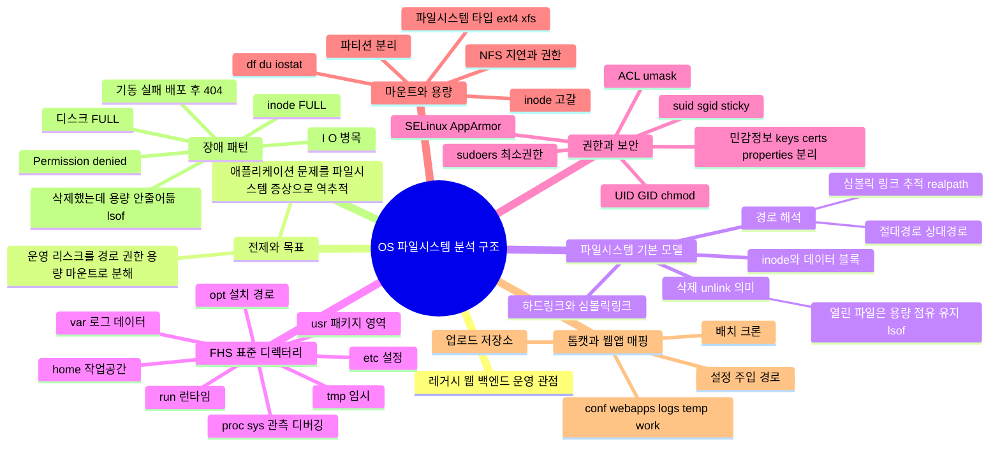
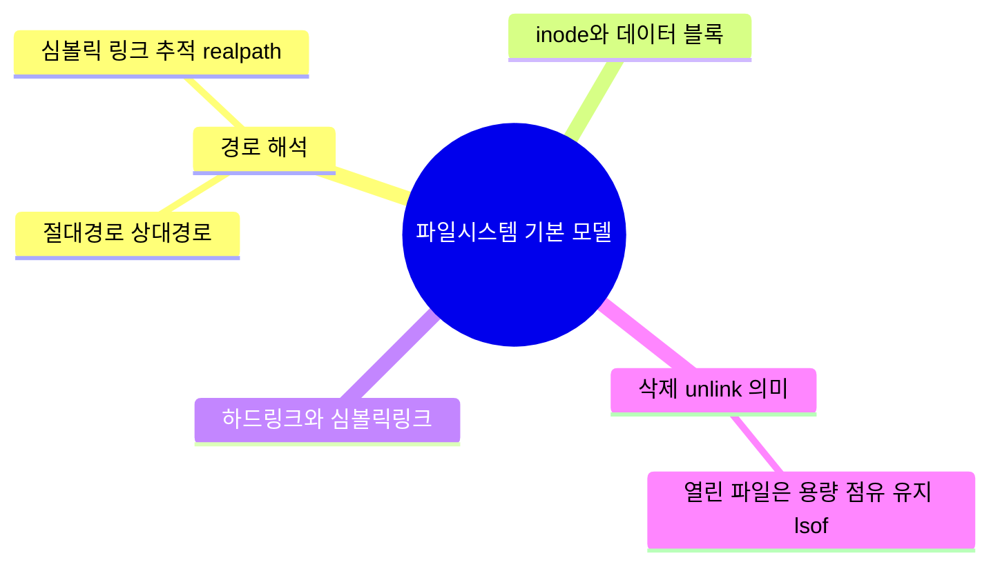

## 개요

- 본 글은 주니어 백엔드 개발자 관점에서 알아야 할 os 파일시스템 구조를 정리한 글입니다.

- 정리 방식은 마인드맵으로 큰 줄기를 뻗은 뒤, 작은 세부사항들은 글로 설명하는 방식입니다.

## 대분류

## 파일시스템 기본 모델

* **파일시스템 기본 모델은 왜 중요하냐**

  * 레거시 운영 장애의 원인(“파일이 없다/권한이 없다/용량이 안 준다/경로가 다르다”)은 대부분 파일시스템 기본 동작에서 나온다. 이 모델을 모르면 조치가 감으로 흐르고, “재기동하면 됨” 수준에서 원인 규명이 멈춘다.

## 1) 경로 해석

* **경로 해석이 왜 필요하냐**

  * 같은 코드라도 “어디서 실행했는지”, “서비스 매니저가 어떤 작업 디렉터리로 기동했는지”, “심볼릭 링크를 통해 어떤 실제 경로를 가리키는지”에 따라 파일을 못 찾거나 엉뚱한 파일을 읽는다. 레거시는 특히 상대경로/하드코딩이 섞여 있어 재현성 없는 장애를 만든다.

### 절대경로 상대경로

* **차이(운영 관점 핵심)**

  * 절대경로는 루트 기준이라 실행 위치가 바뀌어도 동일하게 해석된다.
  * 상대경로는 현재 작업 디렉터리(CWD) 기준이라, systemd/cron/수동 실행 등 기동 방식이 바뀌면 가리키는 대상이 바뀔 수 있다.
* **발표용 한 문장**

  * “운영에서 상대경로는 환경 의존성을 키운다. 설정/키/업로드 경로는 절대경로 + 외부화가 안전하다.”

### 심볼릭 링크 추적 realpath

* **왜 필요한가**

  * 운영 서버는 `current -> releases/...` 같은 배포 구조, 인증서/설정 링크, 마운트 링크 등 “보이는 경로”와 “실제 파일 위치”가 달라지는 구조가 흔하다.
* **실무 포인트**

  * 권한/용량/백업/삭제 판단은 “링크 경로”가 아니라 “실제 타겟 경로(real path)” 기준으로 해야 꼬이지 않는다.

## 2) inode와 데이터 블록

* **왜 알아야 하냐**

  * 장애는 “디스크 용량”만이 아니라 “inode(파일 메타데이터 슬롯)” 고갈로도 난다. df는 남는데 파일 생성이 실패하는 식으로 나타난다.
* **발표 포인트**

  * “운영 관측은 df -h만 보면 반쪽이다. df -i( inode )를 같이 봐야 한다.”

## 3) 하드링크와 심볼릭링크

* **왜 중요한가**

  * ‘링크’는 운영 작업(배포, 롤백, 백업, 정리)에서 실수 유발 지점이다. 특히 “지웠는데 왜 남아있지?”, “링크만 남아 실행이 안 되네” 같은 케이스가 여기서 나온다.
* **핵심 차이(운영자가 알아야 하는 수준)**

  * 하드링크: 같은 실체(inode)를 공유하는 다른 이름 → 원본 이름을 지워도 다른 링크가 남으면 데이터는 남는다.
  * 심볼릭링크: 타겟을 가리키는 바로가기 → 타겟이 사라지면 깨진 링크가 된다.

## 4) 삭제 unlink 의미

* **왜 중요한가**

  * 운영 장애 대응에서 사람들이 제일 먼저 하는 게 `rm`인데, 리눅스에서 삭제는 “데이터 제거”가 아니라 “이름(디렉터리 엔트리) 연결 해제(unlink)”에 가깝다. 이 차이를 모르면 디스크 장애에서 삽질한다.

### 열린 파일은 용량 점유 유지 lsof

* **현실적인 장애 패턴**

  * 로그 파일을 삭제했는데도 `df`가 안 줄어드는 상황이 발생한다(프로세스가 파일을 열어둔 상태로 계속 쓰는 중).
* **정석 대응**

  * `lsof`로 “삭제됐지만 열려있는 파일”을 찾아서 프로세스를 재시작하거나, 로그 로테이션 방식(리오픈/트렁케이트)을 맞춰야 실제로 공간이 반환된다.

다음 큰 줄기 **“FHS 표준 디렉터리”**로 바로 갈까, 아니면 여기 내용을 “발표용 6~8문장 스크립트”로 먼저 압축해줄까?

